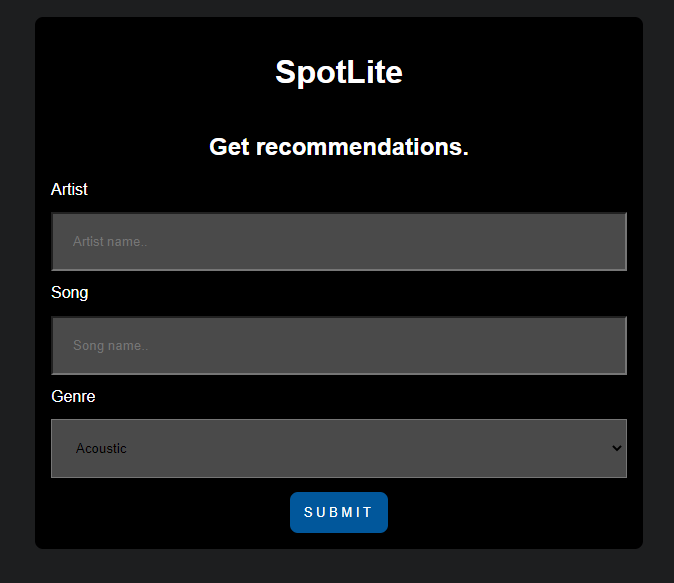
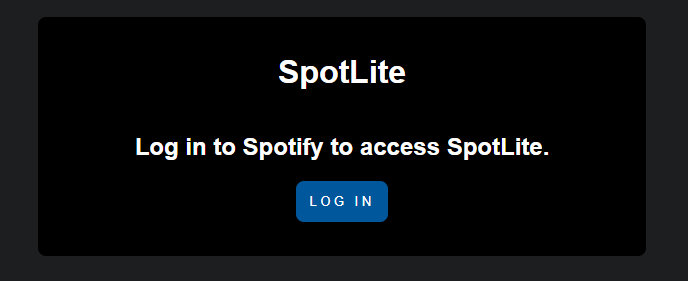
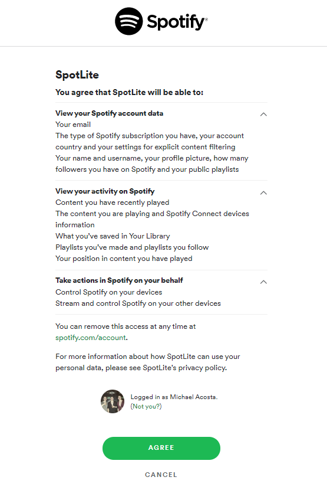
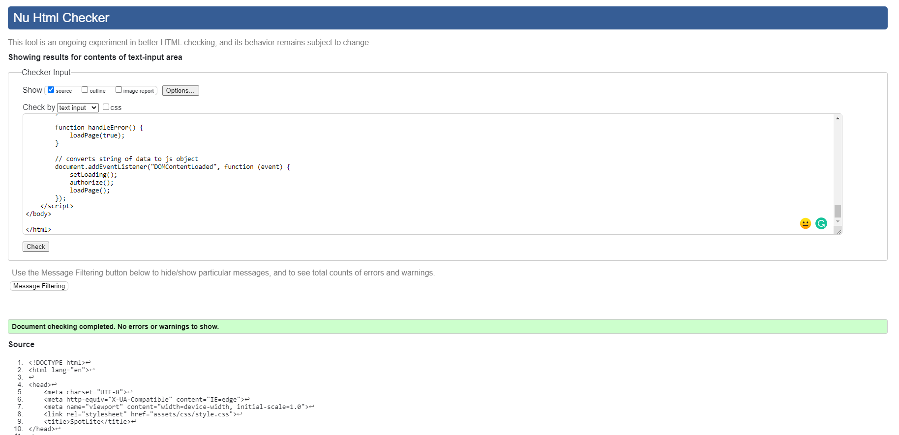
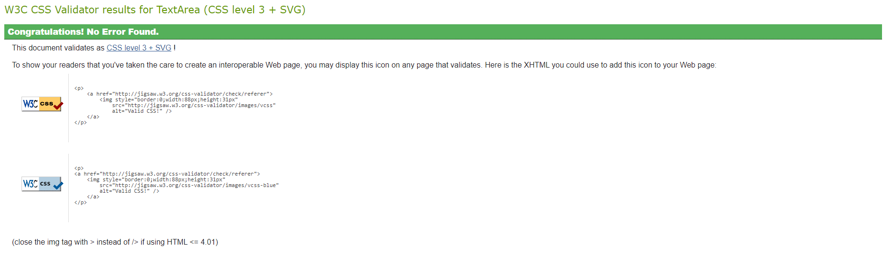
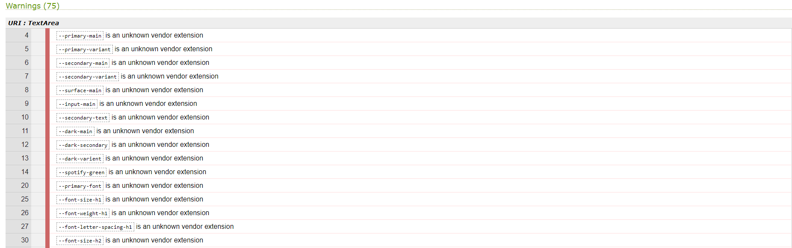

# SpotLite

When deciding on what to do for this project, I knew I wanted to create something that had a real world use. Having worked with APIs in python, I thought it would be a good idea to try to do the same with JavaScript.

Spotify is something many of us use daily so I thought working with the Spotify API would be a really fun challenge and relevent to a lot of people. I decided to create a site that takes in an artist name, song name and a genre and gives you back song recommendations based on the information you have provided.

You must have a premium Spotify account to use this site.

My site is designed around the principals of [Material Design](https://material.io/design). 

### Index page 
 

### Recipe Page


### About Page


## Planning

- __Figma__

    - I created the design for the project using [Figma](https://www.figma.com/). This was a good oppertunity to develop the skills I had learned using Figma for the first time on my last project.
    - Here is a link to my figma file for this project [Figma](https://www.figma.com/file/hRjRB7sUTKK0itIYNlGBlH/SpotLite?node-id=0%3A1)

## Features

Here I will highlight the main features I have included in SpotLite.

### Existing Features

- __Recommendations Form__
    
    

    - As you open SpotLite, the first thing you will see is the recommendations form.
    - This form will allow the user to enter information about a song, artist and genre and get back the recommendations based on the information they have entered. 

- __Log In Redirect__

    

    - If the user does not have an active session after filling in the recommendations form, they will be redirected to this page.
    - Once you hit the log in button, you will then be redirected to the Spotify log in screen.

- __Spotify Log In__
    
    

    - When you reach this screen, you will be promted to agree to let SpotLite access your Spotify data. 
    - Once you agree to this and log in to Spotify you will be redirected back to the recommendations form.

- __Music Cards__
    
    

    - Once you have filled in the recommendations form, you will be given your recommendations results. Here you will see each song displayed in its own card.

    - Each card will act as a link to bring you to the particular song in the Spotify Web Player.

- __Footer__
    
    

    - The footer section includes links to the relevant social media sites for Rare Food. The links will open to a new tab to allow easy navigation for the user. It also includes a link to my GitHub profile.
    - The footer is valuable to the user as it encourages them to keep connected via social media.


### Features Left To Implement

- __Account System__

    - In order to implement some features I've considered for the future, I would need to add an account system and username and password validation. This would include a profile page that will show their saved recipes. To do this I would need to use a database.

- __Functioning Save Button__
    
    

    - I have included a save button feature on my recipe pages for styling purposes. The button is fully responsive but doesn't actual function. In the future, with the use of some JavaScript and JSON, I would love to add in a database system which will allow the user to save their favourite recipes to their verified profile page.

- __Recipe Posting Function__

    - If an account system is implemented, this could allow for users to post their own recipes in a form and share them with the rest of the websites community.

## Testing

- HTML
  - No errors were returned when passing through the official [W3C validator](https://validator.w3.org/)
  
  

  

  

- CSS
  - No errors were found when passing through the official [(Jigsaw) validator](https://jigsaw.w3.org/css-validator/)
  
  

  - I decided to use variable sin my CSS and I am aware that this validator doesn't recognise CSS variables but I am 100% sure that they work as intended.
  
  

- Responsiveness
    - I have tested the responsiveness of my website on multiple browsers and devices. For desktop and laptop, I tested the webiste on Chrome and Safari.

    

    

    - I have tested the responsiveness on iPhone and iPad also.

    

    

    - There are no know issues with responsiveness across all devices and browsers I have tested.

### Unfixed Bugs

- I have encountered no bugs with my website so far, but will document them here if they occur in the future.

### Fixed Bugs

- I had an issue with my footer not sticking to the bottom of the page. In order to fix this I researched the issue. The resolution to this issue was to use ```bottom: 0;```.

## Deployment

- The site was deployed to GitHub pages. The steps to deploy are as follows: 
  - In the GitHub repository, navigate to the Settings tab 
  - From the source section drop-down menu, select the Master Branch
  - Once the master branch has been selected, the page will be automatically refreshed with a detailed ribbon display to indicate the successful deployment.

  The live link can be found here - https://mlenahan.github.io/rare-food/index.html

- To avoid potential plagiarism of my code, If someone wishes to clone the repo, they can do so by using this command in their terminal/command line ```git clone https://github.com/mlenahan/rare-food.git```
- If the user is using GitPod, they can clone the code using the GitPod button that would appear above the code.

### Credits

- The content of my recipes was taken from [BBC Good Food](https://www.bbcgoodfood.com/)
- The inspiration for my design and layout was taken from [Medium](https://medium.com/)
- I learned how to use and implement CSS variables through tutorials created by [Kevin Powell](https://www.youtube.com/kepowob)
- I learned how to use Figma through tutorials created by [Figma](https://www.youtube.com/channel/UCQsVmhSa4X-G3lHlUtejzLA)

### Media

- These are links to all media used throughout the website

    - [About](https://images.immediate.co.uk/production/volatile/sites/30/2021/06/About_GF_v3-408d02b.jpg?quality=90&lb=620,413&background=white)
    - [Pizza Baked Potato](https://www.google.com/url?sa=i&url=http%3A%2F%2Fwww.seasaltwithfood.com%2F2012%2F01%2Fbaked-potato-skins-pepperoni-pizza.html&psig=AOvVaw16Kenk2rwvTzAvjJyAKYzS&ust=1628347980267000&source=images&cd=vfe&ved=0CAsQjRxqFwoTCKiu_IzTnPICFQAAAAAdAAAAABAE)
    - [Slow Cooker Beef Barbacoa](https://i2.wp.com/www.downshiftology.com/wp-content/uploads/2021/02/Barbacoa-Tacos-3.jpg)
    - [Bourbon, Black Cherry & Bacon Brownies](https://unsplash.com/photos/5z1a_EsYs40)
    - [Mezcal Margarita](https://unsplash.com/photos/uE-BD8_Cx18)
    - [Rare Food Icon](https://hatchful.shopify.com/)
    - [Icons](https://fontawesome.com/)
