# SpotLite

When deciding on what to do for this project, I knew I wanted to create something that had a real world use. Having worked with APIs in python, I thought it would be a good idea to try to do the same with JavaScript.

Spotify is something many of us use daily so I thought working with the Spotify API would be a really fun challenge and relevent to a lot of people. I decided to create a site that takes in an artist name, song name and a genre and gives you back song recommendations based on the information you have provided.

# Important information regarding this project

Spotify places particular restrictions on apps created using their API. This app is in development mode which means it is restricted to a maximum of 25 users explicitly assigned by the creator.

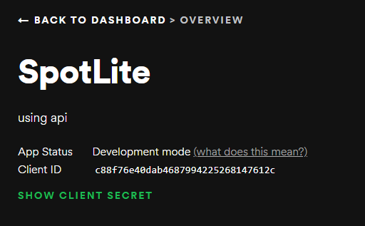

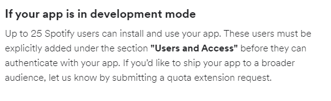

As this is a personal project developed for educational purposes, I can not get access to a quota extension.

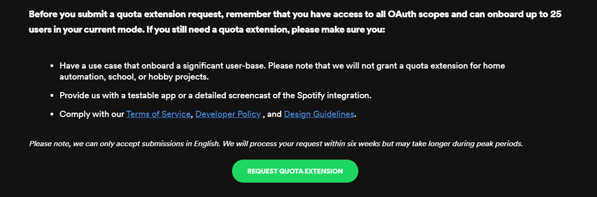

If you wish to gain access to the use of this app, please contact me at michael_lenahan@hotmail.com or on +353870575848. I will add you to the users list as soon as possible.

Here is a video recording of the app in use if you do not wish to gain access but want to see it in action.

[YouTube link to video](https://www.youtube.com/watch?v=JTDleBibUr4&ab_channel=MichaelLenahan)

My site is designed around the principals of [Material Design](https://material.io/design).

## Planning

- __Figma__

    - I created the design for the project using [Figma](https://www.figma.com/). This was a good oppertunity to develop the skills I had learned using Figma for the first time on my last project.
    - Here is a link to my figma file for this project [Figma](https://www.figma.com/file/hRjRB7sUTKK0itIYNlGBlH/SpotLite?node-id=0%3A1)

    - The styling and some of the colours I have used are based around the design of the Spotify App

## Features

Here I will highlight the main features I have included in SpotLite.

### Existing Features

- __Recommendations Form__
    
    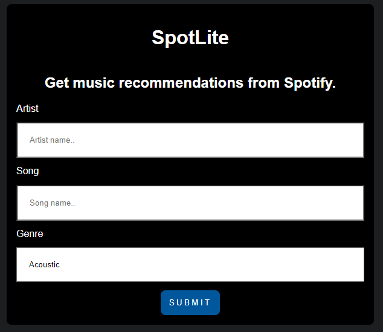

    - As you open SpotLite, the first thing you will see is the recommendations form.
    - This form will allow the user to enter information about a song, artist and genre and get back the recommendations based on the information they have entered. 

- __Log In Redirect__

    

    - If the user does not have an active session after filling in the recommendations form, they will be redirected to this page.
    - Once you hit the log in button, you will then be redirected to the Spotify log in screen.

- __Spotify Log In__
    
    

    - When you reach this screen, you will be promted to agree to let SpotLite access your Spotify data. 
    - Once you agree to this and log in to Spotify you will be redirected back to the recommendations form.

- __Music Cards__
    
    

    - Once you have filled in the recommendations form, you will be given your recommendations results. Here you will see each song displayed in its own card.

    - Each card will act as a link to bring you to the particular song in the Spotify Web Player.

- __Footer__
    
    

    - The footer section includes useful links to the relevant information about SpotLite and social media sites for SpotLite. The links will open to a new tab to allow easy navigation for the user. It also includes a link to my GitHub profile.
    - The footer is valuable to the user as it encourages them to keep connected via social media.


### Features Left To Implement

   - In the future, I plan to add a feature that allows the user to add the link of a particular song to the form and will give back recommendations based on the link they provide.

   - I also plan to add a feature that allows the user to create a playlist based on the recommendations they have received.

## Testing

- HTML
  - No errors were returned when passing through the official [W3C validator](https://validator.w3.org/)
  
  

  

- CSS
  - No errors were found when passing through the official [(Jigsaw) validator](https://jigsaw.w3.org/css-validator/)
  
  

  - I decided to use variable sin my CSS and I am aware that this validator doesn't recognise CSS variables but I am 100% sure that they work as intended.
  
  

- JavaScript
    - To lint my JavaScript files I installed ESLint to my VS Code.
    - To install ESLint, type ```npm install eslint``` in the terminal.
    - I then set up a configureation file by typing ```npm init``` in the terminal to create a ```package.json``` file.
    - I then configured my file by typing ```eslint --init``` in the terminal which creates a ```.eslintrc.{js,yml,json}``` file.
    - To use ESLint you simply type ```eslint``` in the terminal. My file has no errors.

    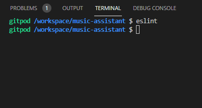

- Responsiveness
    - I have tested the responsiveness of my website on multiple browsers and devices.
    
### Form Page 
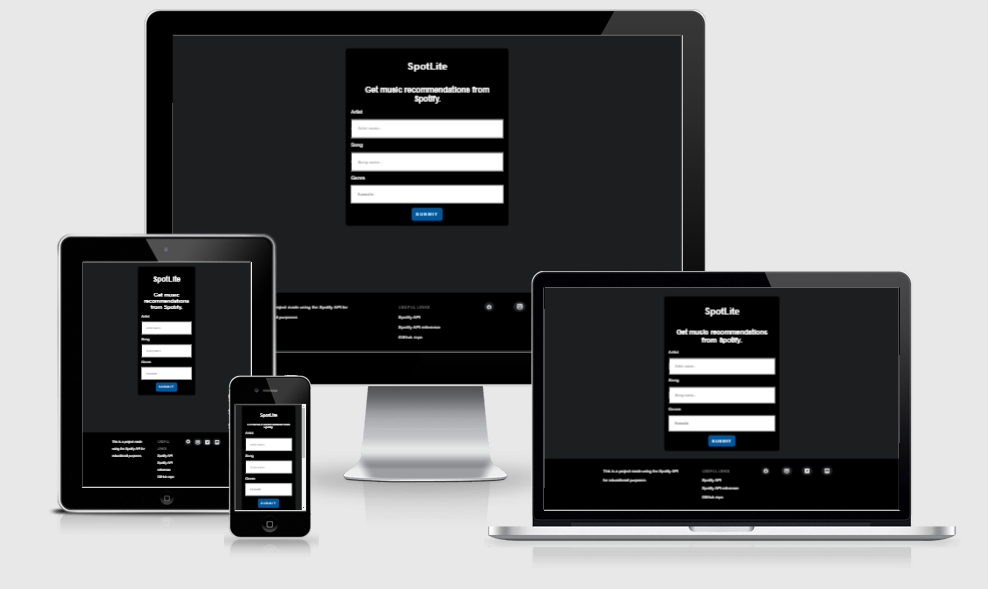 

### iPhone
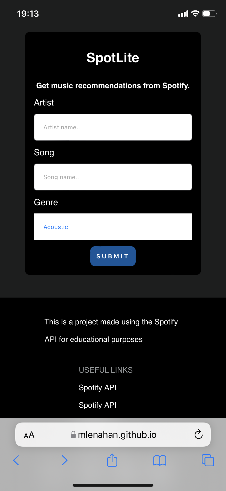

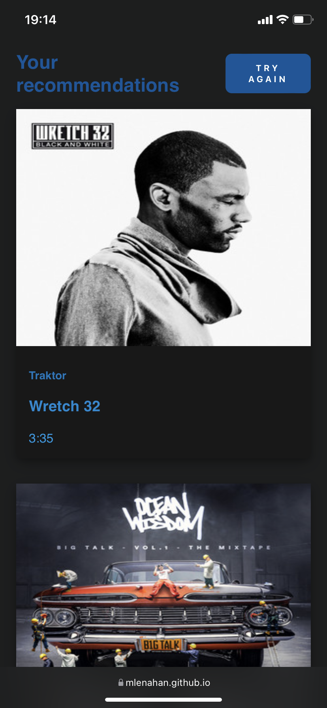

### iPad
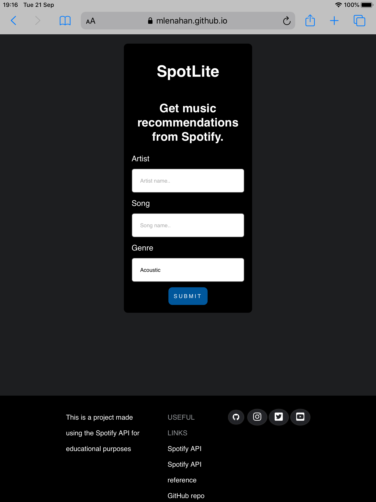

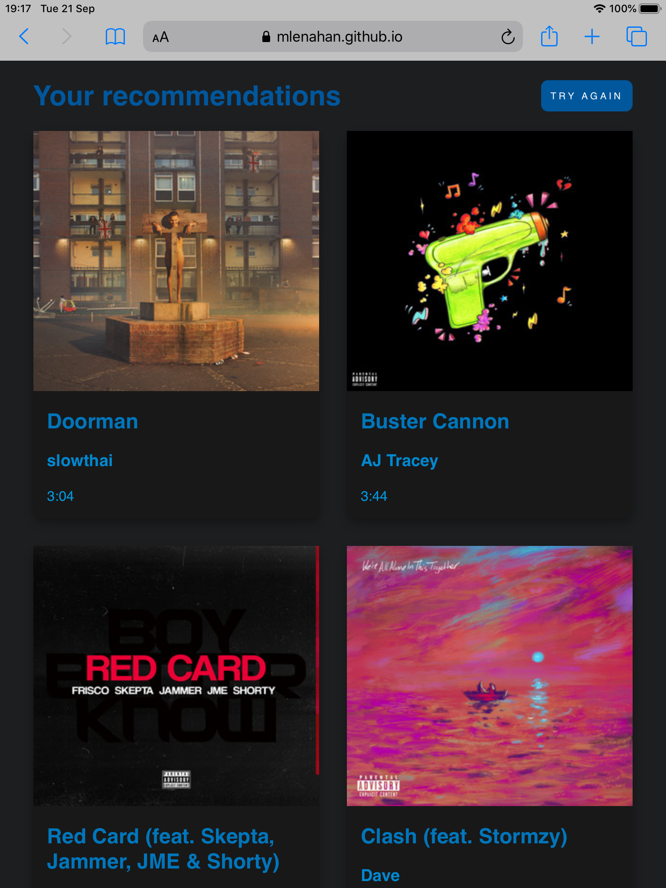


### Recommendations Page Desktop
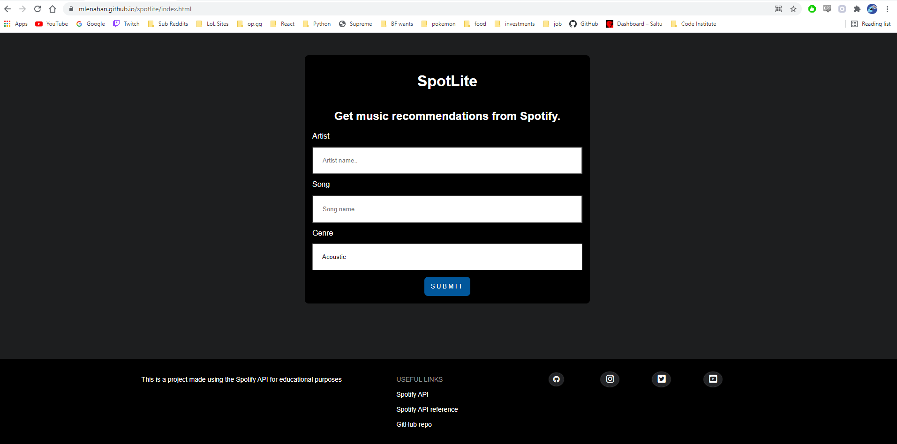

- There are no know issues with responsiveness across all devices and browsers I have tested.

### Unfixed Bugs

- I have encountered no bugs with my website so far, but will document them here if they occur in the future.

### Fixed Bugs

- I had an issue with my genre select part of the recommendations form. In order to fix this I researched the issue. The resolution to this issue was to use ```-webkit-appearance: none;```.

## Deployment

- The site was deployed to GitHub pages. The steps to deploy are as follows: 
  - In the GitHub repository, navigate to the Settings tab 
  - From the source section drop-down menu, select the Master Branch
  - Once the master branch has been selected, the page will be automatically refreshed with a detailed ribbon display to indicate the successful deployment.

  The live link can be found here - https://mlenahan.github.io/spotlite/

- To avoid potential plagiarism of my code, If someone wishes to clone the repo, they can do so by using this command in their terminal/command line ```git clone https://github.com/mlenahan/spotlite.git```
- If the user is using GitPod, they can clone the code using the GitPod button that would appear above the code.

### Credits

- The inspiration for my design and layout was taken from [Spotify](https://www.https://www.spotify.com/)
- I used the [Spotify API](https://www.https://www.developer.spotify.com/) to get the data. 
- I learned a lot about using the Spotify API through a tutorial created by [Maker At Play Coding](https://www.youtube.com/channel/UCUCydzw0QXIrNXi9NYUXgQA)
- Some of my code is taken from this tutorial by [Maker At Play Coding](https://www.youtube.com/watch?v=1vR3m0HupGI&ab_channel=MakerAtPlayCoding)
- I used two functions in my code that I took from stackoverflow. [millisToMinutesAndSeconds](https://stackoverflow.com/questions/21294302/converting-milliseconds-to-minutes-and-seconds-with-javascript) and [titleCase](https://stackoverflow.com/questions/196972/convert-string-to-title-case-with-javascript).

### Media

- These are links to all media used throughout the website

    - All album artwork used is generated using the [Spotify API](https://www.https://www.developer.spotify.com/)
    - [Icons](https://fontawesome.com/)
